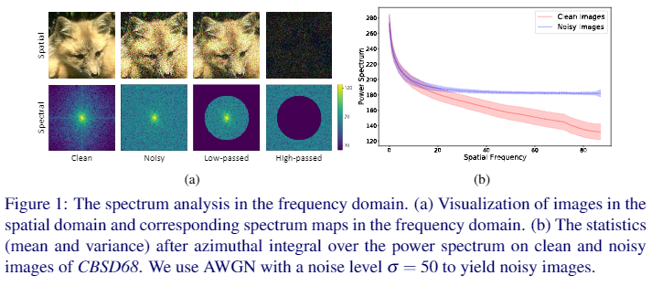

# Unsupervised Image Denoising with Frequency Domain Knowledge (BMVC 2021 Oral) : Official Project Page
This repository provides the official PyTorch implementation of the following paper:
>**Unsupervised Image Denoising with Frequency Domain Knowledge**
>
>Nahyun Kim* (KAIST), Donggon Jang* (KAIST), Sunhyeok Lee (KAIST), Bomi Kim (KAIST), and Dae-Shik Kim (KAIST) (*The authors have equally contributed.)
>
>BMVC 2021, Accepted as Oral Paper.

>**Abstract:** Supervised learning-based methods yield robust denoising results, yet they are inherently limited by the need for large-scale clean/noisy paired datasets. The use of unsupervised denoisers, on the other hand, necessitates a more detailed understanding of the underlying image statistics. In particular, it is well known that apparent differences between clean and noisy images are most prominent on high-frequency bands, justifying the use of low-pass filters as part of conventional image preprocessing steps. However, most learning-based denoising methods utilize only one-sided information from the spatial domain without considering frequency domain information. To address this limitation, in this study we propose a frequency-sensitive unsupervised denoising method. To this end,  a generative adversarial network (GAN) is used as a base structure. Subsequently, we include spectral discriminator and frequency reconstruction loss to transfer frequency knowledge into the generator. Results using natural and synthetic datasets indicate that our unsupervised learning method augmented with frequency information achieves state-of-the-art denoising performance, suggesting that frequency domain information could be a viable factor in improving the overall performance of unsupervised learning-based methods.

<p align="center">
    
</p>

## Requirements
To install requirements:

```setup
conda env create -n [your env name] -f environment.yaml
conda activate [your env name]
```

## To train the model
### Synthetic Noise (AWGN)
1. Download DIV2K dataset for training in [here](https://data.vision.ee.ethz.ch/cvl/DIV2K/)
2. Randomly split the DIV2K dataset into Clean/Noisy set. Please refer the .txt files in `split_data`.
3. Place the splitted dataset(DIV2K_C and DIV2K_N) in `./dataset` directory.
```
dataset
└─── DIV2K_C
└─── DIV2K_N
└─── test
```
4. Use `gen_dataset_synthetic.py` to package dataset in the h5py format.
5. After that, run this command:
```
sh ./scripts/train_awgn_sigma15.sh # AWGN with a noise level = 15
sh ./scripts/train_awgn_sigma25.sh # AWGN with a noise level = 25
sh ./scripts/train_awgn_sigma50.sh # AWGN with a noise level = 50
```
6. After finishing the training, `.pth` file is stored in `./exp/[exp_name]/[seed_number]/saved_models/` directory. 

###  Real-World Noise
1. Download SIDD-Medium Dataset for training in [here](https://www.eecs.yorku.ca/~kamel/sidd/dataset.php)
2. Radnomly split the SIDD-Medium Dataset into Clean/Noisy set. Please refer the .txt files in `split_data`.
3. Place the splitted dataset(SIDD_C and SIDD_N) in `./dataset` directory.
```
dataset
└─── SIDD_C
└─── SIDD_N
└─── test
```
4. Use `gen_dataset_real.py` to package dataset in the h5py format.
5. After that, run this command:
```
sh ./scripts/train_real.sh
```
6. After finishing the training, `.pth` file is stored in `./exp/[exp_name]/[seed_number]/saved_models/` directory.


## To evaluate the model
### Synthetic Noise (AWGN)
1. Download CBSD68 dataset for evaluation in [here](https://drive.google.com/drive/folders/1lNet_6YH-sAG3nkR1zb2EKSiFmek7ywQ?usp=sharing)
2. Place the dataset in `./dataset/test` directory.
```
dataset
└─── train
└─── test
     └─── CBSD68
     └─── SIDD_test
```
3. After that, run this command:
```
sh ./scripts/test_awgn_sigma15.sh # AWGN with a noise level = 15
sh ./scripts/test_awgn_sigma25.sh # AWGN with a noise level = 25
sh ./scripts/test_awgn_sigma50.sh # AWGN with a noise level = 50
```

### Real-World Noise
1. Download the SIDD test dataset for evaluation in [here](https://drive.google.com/drive/folders/1lNet_6YH-sAG3nkR1zb2EKSiFmek7ywQ?usp=sharing)
2. Place the dataset in `./dataset/test` directory.
```
dataset
└─── train
└─── test
     └─── CBSD68
     └─── SIDD_test
```
3. After that, run this command:
```
sh ./scripts/test_real.sh
```

## Pre-trained model
We provide pre-trained models in `./checkpoints` directory.
```
checkpoints
|   AWGN_sigma15.pth # pre-trained model (AWGN with a noise level = 15)
|   AWGN_sigma25.pth # pre-trained model (AWGN with a noise level = 25)
|   AWGN_sigma50.pth # pre-trained model (AWGN with a noise level = 50)
|   SIDD.pth # pre-trained model (Real-World noise)
```

## Acknowledgements
This code is built on [U-GAT-IT](https://github.com/znxlwm/UGATIT-pytorch),[CARN](https://github.com/nmhkahn/CARN-pytorch), [SSD-GAN](https://github.com/cyq373/SSD-GAN). We thank the authors for sharing their codes.


## Contact
If you have any questions, feel free to contact me (jdg900@kaist.ac.kr)